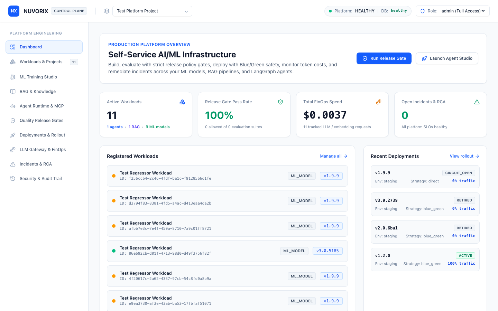
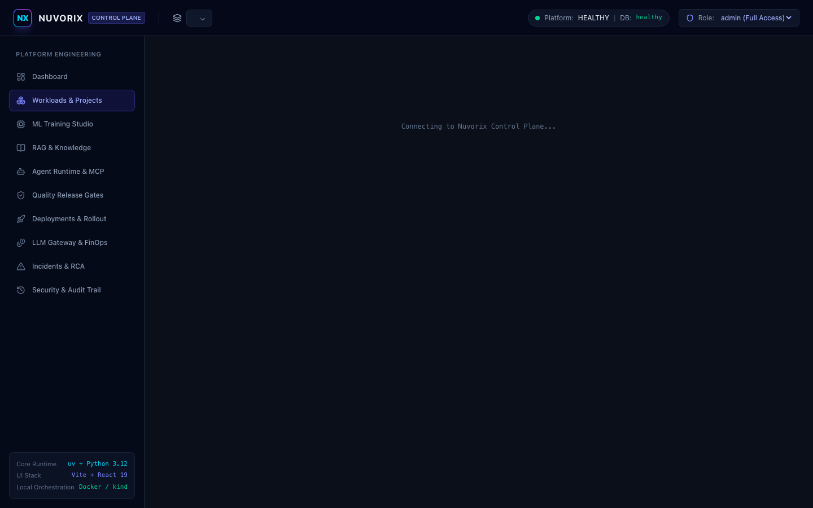
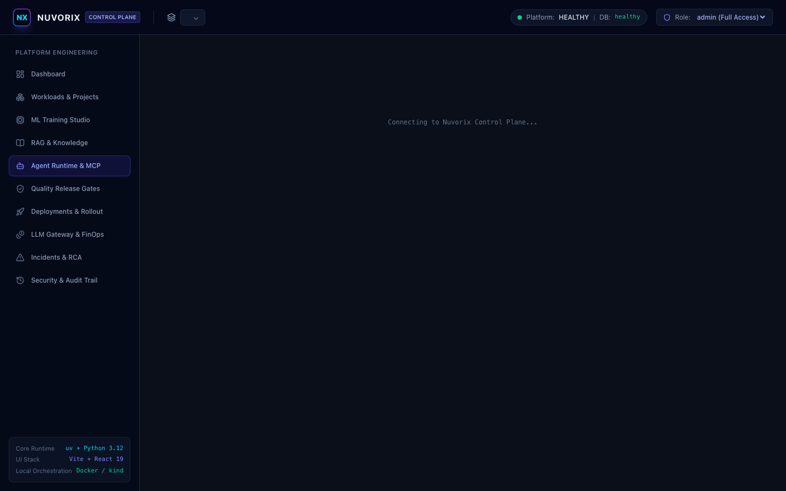
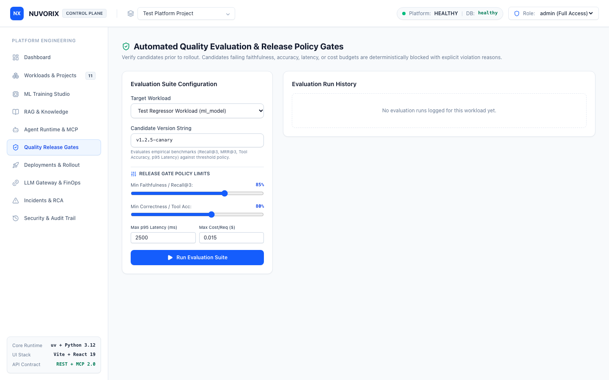
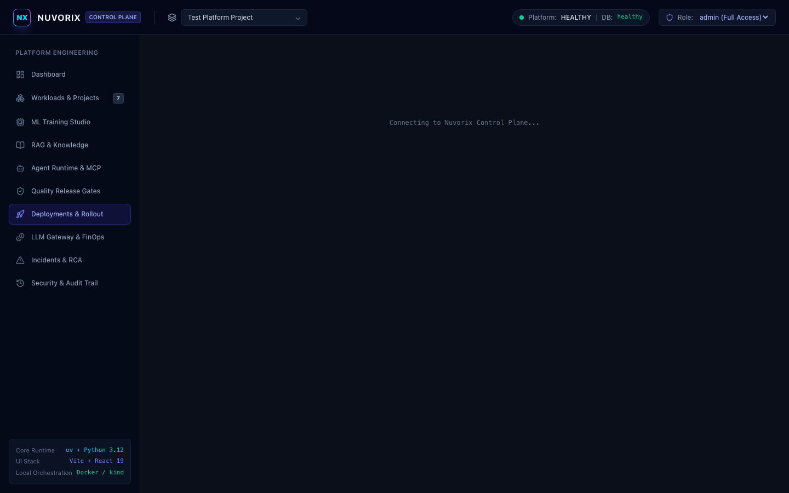
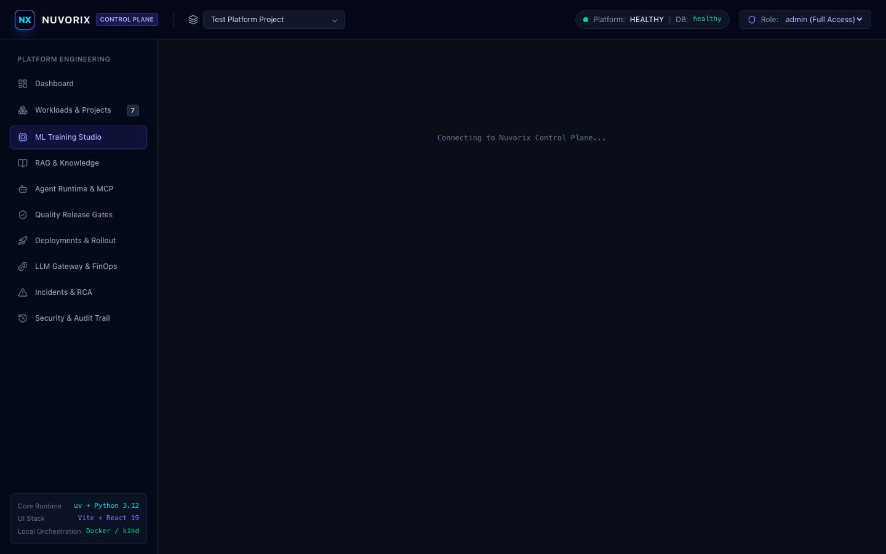
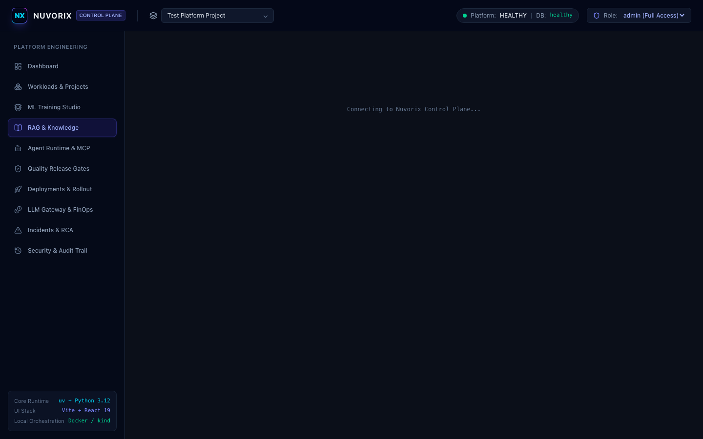
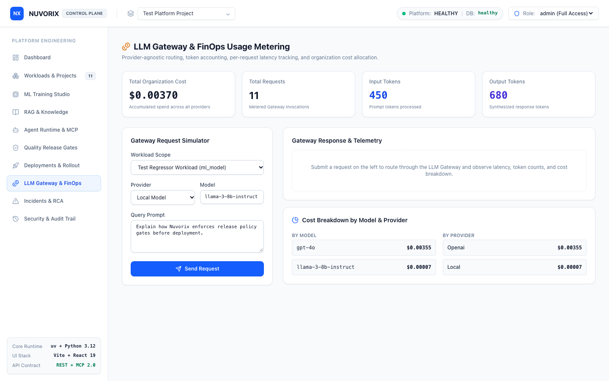
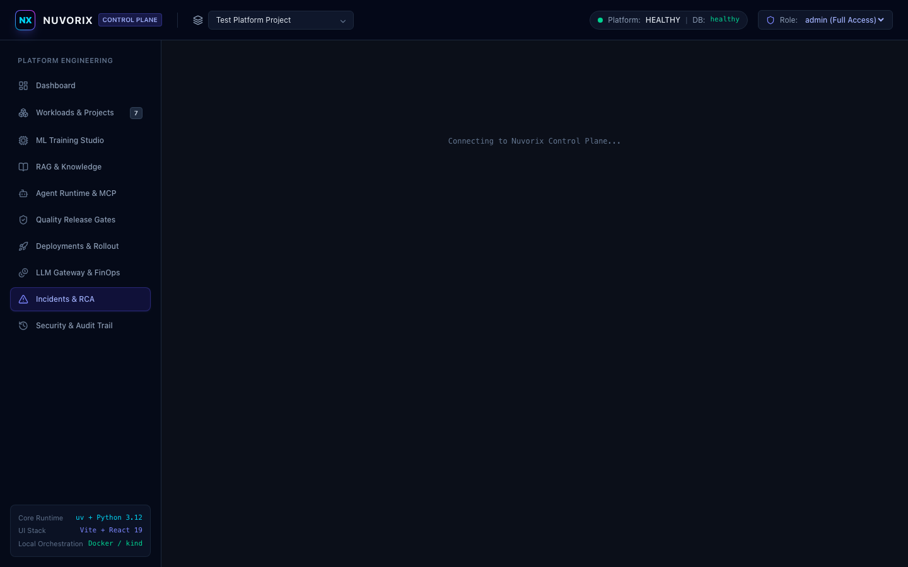
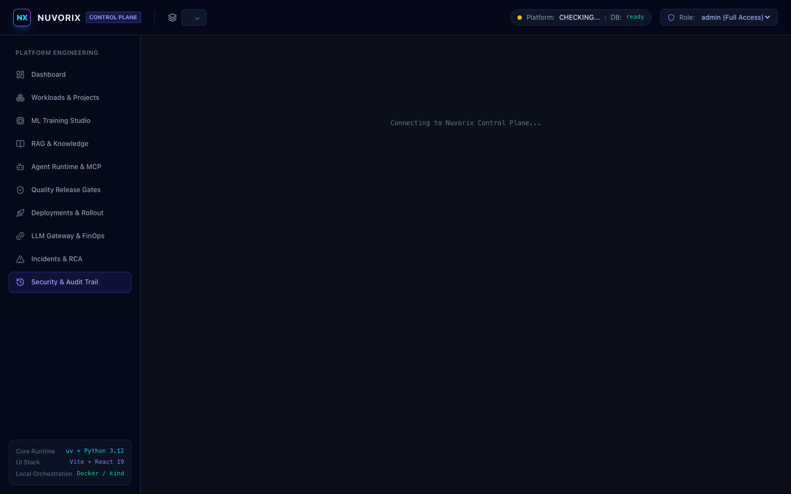

# Nuvorix — AI/ML Production Platform

<p align="center">
  <a href="https://github.com/VNT1998/nuvorix/actions/workflows/ci.yml">
    
  </a>
  
  
  
  
  
  
  
  
</p>

> **A self-service platform for building, evaluating, deploying, governing, and operating ML and LLM workloads.**
> Built with strict architectural invariants, automated release quality gates, LangGraph stateful agent orchestration, and full-stack observability.

---

## ⚡ Quickstart (Under 5 Minutes)

```bash
# 1. Clone repository
git clone https://github.com/VNT1998/nuvorix.git
cd nuvorix

# 2. Bootstrap all backend and frontend dependencies
make install

# 3. Verify entire repository quality gate (Lint, Format, Mypy, Vitest, Pytest with Coverage, and Vite Build)
make check

# 4. Launch full platform stack via Docker Compose
make docker-up
```
- **Web Console**: [http://localhost:5173](http://localhost:5173)
- **Control Plane API & Swagger Docs**: [http://localhost:8000/docs](http://localhost:8000/docs)
- **Health Check**: [http://localhost:8000/health](http://localhost:8000/health)
- **Prometheus Metrics**: [http://localhost:8000/metrics](http://localhost:8000/metrics)

---

## 📚 Architectural Specifications & Decision Records

Detailed systems design and rationale are documented under `docs/`:
- **[System Architecture & Invariants](docs/architecture.md)**: Deep dive into the layered architecture, security boundaries, and telemetry pipeline.
- **[ADR 0001: Hybrid LLM Provider Gateway and FinOps](docs/adr/0001-hybrid-llm-routing.md)**
- **[ADR 0002: LangGraph State Machine for Multi-Tenant Tool Orchestration](docs/adr/0002-stateful-agent-orchestration.md)**
- **[ADR 0003: Strict Pre-Release Empirical Evaluation Gates](docs/adr/0003-quality-gate-invariant.md)**

---

## 🏛️ Core Architecture Principle

> **Nuvorix separates probabilistic AI components from deterministic platform controls. Embeddings, LLMs, and agents handle probabilistic workloads, while authorization, tenancy, release gates, state transitions, and irreversible platform actions are enforced by deterministic services.**

---

## 🌟 Executive Summary

AI/ML and GenAI teams repeatedly reinvent infrastructure for experiment tracking, RAG pipelines, agent runtimes, release gates, Blue/Green rollouts, telemetry, secrets, and cost monitoring.

**Nuvorix** provides production-grade platform primitives that allow engineers to move from development to production without rebuilding platform capabilities for every project.

```text
Create Workload
     ↓
Develop / Train (Scikit-Learn / MLflow)
     ↓
Register Artifacts / Prompts / Datasets
     ↓
Automated Evaluation Suite (Recall@3, MRR@3, Tool Accuracy, p95 Latency)
     ↓
Apply Release Policy Gate (ALLOW / BLOCK)
     ↓
Deploy & Shift Traffic (Dev / Staging / Production / Blue-Green)
     ↓
Observe (OpenTelemetry Traces, Prometheus Metrics, FinOps Cost)
     ↓
Detect Regressions & Incidents (Active Deployment Correlation)
     ↓
One-Click Remediate or Safe Automated Rollback
```

---

## 📸 Platform Console Tour

### 1. Platform Executive Dashboard
Real-time control plane health, active workload distribution, quality gate pass rates, FinOps spend tracking, and active deployment rollout monitors.


---

### 2. Workloads & Project Organization
Multi-project boundaries organizing ML models, RAG subsystems, and LangGraph agents with semantic versioning and deployment readiness status.


---

### 3. Agent Runtime Studio & MCP Tools
Interactive LangGraph execution runner with step-by-step trace inspection (`Planner` → `Tool Call` → `Observation` → `Final Response`), ExecutionContext authorization, and Model Context Protocol (MCP) tool security.


---

### 4. Automated Evaluation & Release Policy Gates
Deterministic release gates evaluating candidate versions against empirical policy thresholds (`Recall@3`, `MRR@3`, tool selection accuracy, p95 latency distribution, cost). Prevents degraded versions from reaching staging or production.


---

### 5. Deployment State Machine & Rollback
Deterministic deployment lifecycle enforcing legal state transitions (`candidate`, `active`, `retired`, `rolled_back`, `circuit_open`), `Idempotency-Key` deduplication, and safe automated rollback.


---

### 6. ML Platform Training Lifecycle
Real Scikit-learn training pipeline calculating RMSE, MAE, R², and duration metrics, persisting joblib artifacts, and managing MLflow model registry promotion.


---

### 7. RAG Knowledge Hub & Semantic Vector Retrieval
Ingest engineering specifications, compute normalized dense vector embeddings (FastEmbed BAAI/bge-small-en-v1.5), chunk passages, and perform vector similarity queries with PostgreSQL pgvector or cosine similarity fallback.


---

### 8. LLM Gateway & FinOps Usage Metering
Provider-agnostic routing (`Local`, `OpenAI`, `Anthropic`, `Gemini`), token accounting, request latency measurement, and granular FinOps cost estimation based on model pricing tiers.


---

### 9. Incident Remediation & Rollback Correlation
Correlates operational incidents with active workload deployments, verifies deployment ownership and active state before remediation, and triggers safe automated rollback.


---

### 10. Security, Multi-Tenancy & Audit Logging
Multi-tenant isolation across organizations, database-backed API keys (`nvx_*`) with constant-time verification, RBAC permissions and token scopes, and complete audit logging with request correlation (`X-Request-ID`).


---

## 🚀 Quickstart

### Prerequisites
- Python 3.12+ and [uv](https://github.com/astral-sh/uv)
- Node.js 20+ and npm
- Docker (optional for containerized deployment)

### 1. Clone & Setup Backend with `uv`
```bash
git clone https://github.com/VNT1998/nuvorix.git
cd nuvorix

# Install Python dependencies using uv
uv sync --extra dev
```

### 2. Start Control Plane API
```bash
uv run python -m uvicorn apps.api.app.main:app --host 0.0.0.0 --port 8000 --reload
```
- API is live at: `http://localhost:8000`
- Interactive OpenAPI Docs: `http://localhost:8000/docs`
- Health check: `http://localhost:8000/health`
- Prometheus metrics: `http://localhost:8000/metrics`

### 3. Start Web Platform Console with `Vite`
In a new terminal:
```bash
cd apps/web
npm install --legacy-peer-deps
npm run dev
```
- Platform Console is live at: `http://localhost:5173`

---

## 🛠️ CLI Usage (`nuvorix`)

Nuvorix includes a command-line interface built with Click:

```bash
# Check platform health
uv run nuvorix health

# Manage projects
uv run nuvorix project list
uv run nuvorix project create "Autonomous Systems" -d "Edge AI and Agent platform"

# Manage workloads
uv run nuvorix workload list
uv run nuvorix workload create <project_id> "support-agent" --type agent

# Evaluate a candidate version against quality gates
uv run nuvorix evaluate <workload_id> --version v1.2.0

# Deploy workload to staging or production
uv run nuvorix deploy <workload_id> --version v1.2.0 --env staging --strategy blue_green

# Execute immediate rollback
uv run nuvorix rollback <deployment_id>

# Run LangGraph agent directly from CLI
uv run nuvorix agent-run <workload_id> "Check cluster health and find rollback procedures"
```

---

## 🐍 Python SDK (`nuvorix`)

```python
from nuvorix import NuvorixClient

client = NuvorixClient(base_url="http://localhost:8000", role="admin")

# 1. Health check
health = client.health()
print(f"Platform status: {health['status']}")

# 2. Train and promote ML model
train_run = client.models.train(
    workload_id="w-churn-predictor",
    model_name="churn_ridge",
    hyperparameters={"alpha": 0.5, "max_iter": 500}
)
print(f"Model trained with RMSE: {train_run['metrics']['rmse']}")

# 3. Ingest knowledge into RAG
doc = client.knowledge.ingest(
    kb_id="kb-nuvorix-core",
    title="Deployment Safety",
    content="All candidate deployments must pass faithfulness and latency gates."
)

# 4. Run LangGraph Agent
agent_res = client.agents.run(
    workload_id="w-support-agent",
    prompt="Search knowledge base for deployment safety invariants"
)
print(agent_res["final_response"])

# 5. Evaluate and deploy
eval_res = client.evaluations.run(
    workload_id="w-support-agent",
    version="v1.2.0"
)
if eval_res["decision"] == "ALLOW":
    client.deployments.create(
        workload_id="w-support-agent",
        version="v1.2.0",
        environment="production"
    )
```

---

## ⚖️ Local Development vs. Production Capabilities

| Capability | Local Development | Production | Status |
|---|---|---|---|
| **Application Database** | SQLite (`aiosqlite`) | PostgreSQL 16 | Verified Local (SQLite) / Production-Ready (Postgres) |
| **Vector Database** | Cosine similarity fallback | PostgreSQL `pgvector` (`<=>` distance) | Verified Real |
| **MLflow Tracking** | Local file / SQLite (`mlflow.db`) | Remote MLflow tracking server + object store | Verified Local (Local) / Artifact Only (Remote) |
| **Queue Durability** | In-process asynchronous execution | Redis-backed durable queue (**not yet implemented**) | In-Process (Current) / Not Implemented (Redis queue) |
| **Artifact Storage** | `LocalFileSystemStorage` (`~/.nuvorix/artifacts`) | `S3CompatibleStorage` (S3 / R2 / MinIO) | Verified Local (Local) / Artifact Only (S3) |
| **Authentication** | `AUTH_MODE=development` (headers permitted) | `AUTH_MODE=production` (Signed tokens / DB API keys) | Production-Ready |
| **Telemetry & Traces** | In-memory ring buffer (`/telemetry/traces`) | OTLP HTTP collector exporter | Verified Real |
| **Traffic Shifting** | Logical database state & traffic percentage | Kubernetes Service / Ingress / ArgoCD | Verified Real (Logical) / Artifact Only (K8s) |

---

## 🧪 Testing & Code Quality

Nuvorix features a comprehensive test suite across 9 dedicated test modules verifying:
- Database-backed API keys (`nvx_*`), constant-time verification, revocation, and RBAC token scopes
- Tool authorization, ExecutionContext passing, and multi-tenant isolation
- PostgreSQL pgvector and SQLite cosine similarity and distance alignment
- Empirical evaluation metrics (`Recall@3`, `MRR@3`, tool selection router accuracy, p95 latency distributions)
- Deployment state machine transitions, `Idempotency-Key` deduplication, and safe incident rollbacks
- OpenTelemetry span correlation and W3C trace context propagation
- Real LangGraph agent loops and Model Context Protocol (MCP) tool execution
- Real MLflow run tracking and model registry promotion

See [`docs/IMPLEMENTATION_STATUS.md`](docs/IMPLEMENTATION_STATUS.md) for the verified capability matrix.

```bash
# Run full pytest test suite (38 passed across 9 test suites)
uv run pytest

# Run Ruff linter & type checks
uv run ruff check apps packages

# Verify TypeScript & Vite production build
cd apps/web && npm run build && cd ../..

# Verify Terraform configuration
terraform fmt -check -recursive infra/terraform
terraform -chdir=infra/terraform/environments/dev validate
```

---

## ☸️ Cloud-Native Deployment (Helm & Terraform)

### Production Helm Chart
Deploy Nuvorix to any Kubernetes cluster (EKS, GKE, AKS, or local kind):
```bash
# Install or upgrade Nuvorix via Helm
helm upgrade --install nuvorix ./infra/helm/nuvorix \
  --namespace nuvorix \
  --create-namespace \
  --values ./infra/helm/nuvorix/values.yaml
```

The Helm chart includes:
- Production deployments and services for `api` and `web`
- Horizontal Pod Autoscaler (`HPA`) based on CPU & Memory utilization
- Ingress with TLS secret configuration and routing
- ConfigMaps & Secrets for environment variable management
- ServiceAccount with granular role definitions

### Infrastructure as Code (Terraform)
Automate cluster provisioning and Nuvorix deployment:
```bash
cd infra/terraform/environments/dev
terraform init
terraform plan
terraform apply
```

Includes modular components:
- `modules/nuvorix_cluster`: Kubernetes namespace, Helm release, and ingress setup
- `modules/storage`: Persistent volume claim management for model artifacts

---

## 🐳 Docker Compose & Local Kubernetes (`kind`)

### Docker Compose
Run the entire platform (API, Web, PostgreSQL with pgvector, and Redis):
```bash
docker compose up -d --build
```
- API: `http://localhost:8000`
- Web Console: `http://localhost:5173`
- PostgreSQL: `localhost:5432`

### Kubernetes on `kind`
Deploy Nuvorix to a local Kubernetes cluster:
```bash
# Create cluster
kind create cluster --name nuvorix

# Apply Kubernetes manifests
kubectl apply -f infra/kind/nuvorix-all.yaml

# Verify pods
kubectl get pods -n nuvorix
```

---

## 🏛️ Architecture & Directory Structure

```text
nuvorix/
├── apps/
│   ├── api/
│   │   ├── app/
│   │   │   ├── api/v1/         # Endpoints (Projects, Workloads, ML, RAG, Agents, Deployments, Incidents)
│   │   │   ├── core/           # Config, RBAC security, Prometheus telemetry
│   │   │   ├── db/             # Async SQLAlchemy session & base
│   │   │   ├── models/         # Database models (Org, Project, Workload, Model, Deployment, etc.)
│   │   │   ├── schemas/        # Pydantic v2 schemas with ConfigDict
│   │   │   ├── services/       # ML service, RAG vector service, LangGraph agent runtime, Eval gates
│   │   │   ├── main.py         # FastAPI application entrypoint
│   │   │   └── seed.py         # Deterministic seed data generator
│   │   ├── tests/              # Pytest test suite
│   │   └── Dockerfile          # Multi-stage production container
│   └── web/                    # Vite + React 19 + TypeScript + Tailwind CSS Console
│       ├── src/
│       │   ├── components/     # Navbar, Sidebar
│       │   ├── pages/          # Dashboard, ML Studio, RAG Hub, Agent Studio, Evaluations, Deployments, RCA
│       │   ├── lib/api.ts      # Typed frontend API client
│       │   └── types.ts        # Domain TypeScript interfaces
│       ├── Dockerfile          # Production Nginx container
│       └── nginx.conf          # Reverse proxy configuration
├── packages/
│   ├── cli/                    # Click Python CLI (nuvorix)
│   └── sdk-python/             # Python SDK client (NuvorixClient)
├── infra/
│   ├── helm/nuvorix/           # Enterprise Helm chart (API, Web, Ingress, HPA, ConfigMaps)
│   ├── terraform/              # Terraform IaC modules and dev environment
│   ├── compose/
│   └── kind/                   # Kubernetes Deployment, Service, ConfigMap manifests
├── .github/
│   └── workflows/              # CI/CD (Ruff lint, Pytest, Vite build, Wheel packaging)
├── docs/
│   ├── screenshots/            # High-resolution platform tour screenshots
│   └── IMPLEMENTATION_STATUS.md # Master build specification tracker
├── docker-compose.yml          # Local multi-service orchestration
├── pyproject.toml              # Monorepo uv configuration
└── README.md
```

---

## 📄 License

Distributed under the MIT License. See `LICENSE` for more information.
