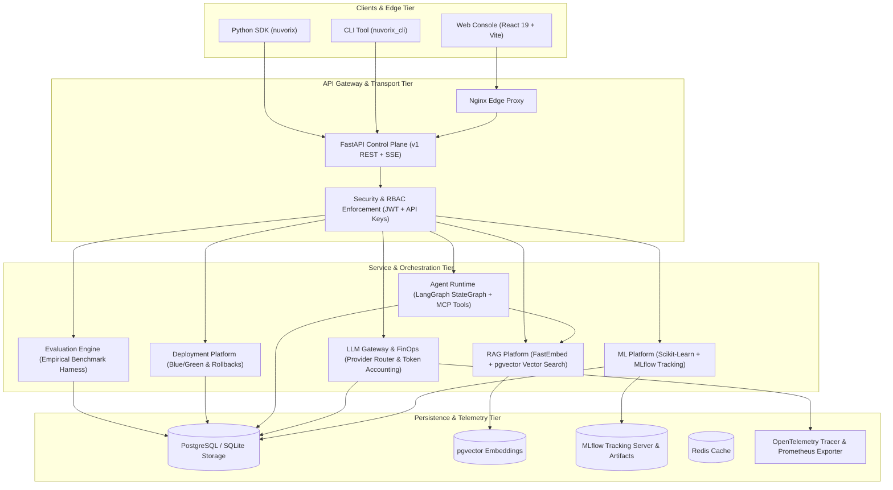

# Nuvorix Architecture & Platform Specification

**Author**: Staff Software Engineer & Platform Architect  
**Version**: 0.1.0  
**Status**: Production / Hardened  

---

## 1. Executive Overview

Nuvorix is a unified, enterprise-grade AI/ML production platform engineered to bridge the gap between model development, generative agent orchestration, and reliable production operations. 

Modern AI platforms frequently suffer from three critical failure modes:
1. **Unverifiable Promotions**: Models and agents are promoted to production environments based on developer intuition rather than empirical regression benchmarks.
2. **Untracked Tenant Boundaries**: Multi-tenant systems leak documents, models, and idempotency keys across client organizations.
3. **Unmetered & Insecure LLM Invocations**: Generative workloads run with unmetered token consumption, lacking fail-closed safety when external providers degrade.

Nuvorix resolves these failure modes by enforcing deterministic **Architectural Invariants** enforced at every layer of the platform stack.

---

## 2. Platform Architecture Diagram

---

## 3. Core Architectural Invariants

### Invariant 1: Mandatory Pre-Release Evaluation Quality Gates
No workload candidate (ML model, RAG pipeline, or autonomous agent) can be promoted to a `production` deployment without a completed evaluation run returning an explicit `ALLOW` decision.
- **Empirical Metric Thresholds**: RAG evaluations measure actual Recall@3, MRR@3, faithfulness, and answer correctness against held-out benchmark datasets. ML models evaluate empirical RMSE, accuracy, and p95 inference latency distributions.
- **Fail-Closed Artifact Verification**: If candidate artifacts are missing or corrupted on disk, the evaluation status immediately transitions to `failed` and emits a `BLOCK` decision.
- **Break-Glass Emergency Bypass**: In critical production recovery situations, operators possessing the explicit `deployments:bypass_gate` permission may bypass the quality gate only by supplying a non-empty `bypass_reason`. Bypasses trigger high-severity audit log events (`deployments:break_glass_create`).

### Invariant 2: Strict Tenant Isolation & Idempotency
- **Composite Unique Keys**: Deployment requests enforce idempotency keys scoped strictly to `(organization_id, endpoint, key)`. Key collisions across distinct tenants are architecturally impossible.
- **Service-Level Tenant Boundaries**: All service queries (`DeploymentPlatformService`, `RAGPlatformService`, `AgentRuntimeService`) require explicit `organization_id` context. Silent cross-tenant fallback is strictly prohibited.

### Invariant 3: Zero Dev-Header Authentication in Production
- When `ENVIRONMENT=production` or `AUTH_MODE=production`, development fallback headers (`X-User-Role`, `X-User-Id`, `X-Org-Id`) are rejected immediately with HTTP 401. Callers must present either a cryptographically signed HMAC-SHA256 JWT bearer token or a verified database API key (`nvx_*`).

### Invariant 4: Fail-Closed LLM Provider Routing
- The LLM Gateway abstracts heterogeneous providers (OpenAI, Anthropic, Gemini, Ollama, and local deterministic execution).
- In `production`, failures in external provider APIs raise explicit errors rather than falling back to local deterministic mock generators, preventing fabricated operational data.
